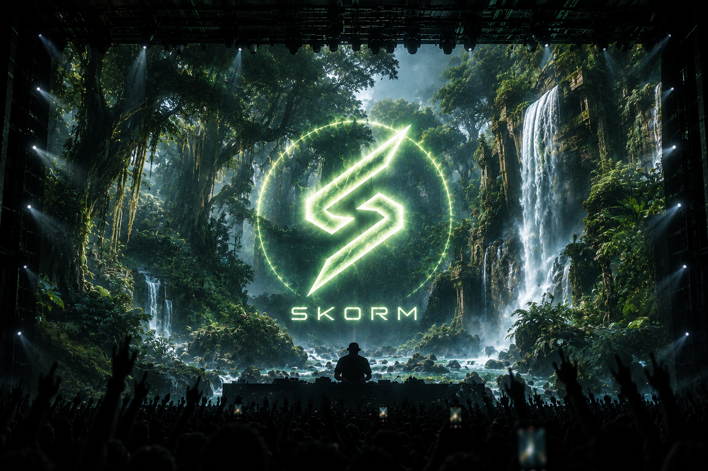

# SKORM BetterDiscord Theme Collection

Five dark, translucent BetterDiscord themes with matching animated SKORM
server icons, plus one dynamic theme synchronized from Nextcloud.

| Theme | Visual identity | Download |
|---|---|---|
| Cyberpunk | Neon magenta and cyan | [`SkormCyberpunk.theme.css`](https://github.com/Bl3aven/tropical-skorm-theme/releases/latest/download/SkormCyberpunk.theme.css) |
| Galaxy | Violet deep space | [`SkormGalaxy.theme.css`](https://github.com/Bl3aven/tropical-skorm-theme/releases/latest/download/SkormGalaxy.theme.css) |
| Greek | Marble and Olympian gold | [`SkormGreek.theme.css`](https://github.com/Bl3aven/tropical-skorm-theme/releases/latest/download/SkormGreek.theme.css) |
| Hell | Obsidian, lava and embers | [`SkormHell.theme.css`](https://github.com/Bl3aven/tropical-skorm-theme/releases/latest/download/SkormHell.theme.css) |
| Tropical | Dark emerald jungle | [`SkormTropical.theme.css`](https://github.com/Bl3aven/tropical-skorm-theme/releases/latest/download/SkormTropical.theme.css) |
| Dynamic | Active Nextcloud design | [`TropicalSkorm.theme.css`](https://github.com/Bl3aven/tropical-skorm-theme/releases/latest/download/TropicalSkorm.theme.css) |



## Installation

1. Download one `.theme.css` file from the table.
2. Open Discord and go to **Settings → BetterDiscord → Themes**.
3. Select **Open Themes Folder**.
4. Copy the downloaded file into that folder.
5. Enable only the SKORM theme you want to use.

The BetterDiscord theme folder on Windows is:

```text
%appdata%\BetterDiscord\themes
```

The five named themes are fixed: selecting `SKORM Hell`, for example, always
loads the Hell background, red palette and matching animated logo.

## Dynamic theme

`TropicalSkorm.theme.css` is the dynamic edition. It always loads:

```text
assets/main.png
assets/server-icon-main.webp
assets/active-palette.css
```

The repository synchronizes these files from Nextcloud approximately every
30 minutes. For the five known designs, the workflow compares the SHA-256 of
`main.png` with
[`assets/logos/design-map.json`](assets/logos/design-map.json), then selects
the matching animated logo and color palette automatically.

For an unknown or modified design, place its animated logo at
`logos/main.webp` in Nextcloud. The dynamic theme uses that logo with the
tropical fallback palette until a dedicated palette is added to the map.

## Server icon scope

The bundled animated icon targets the `SKORM - Agency` guild ID. It changes
the server rail icon locally for people using one of these themes; it does not
replace the official Discord server icon for members without BetterDiscord.

To target another server, use
[`snippets/server-icon.template.css`](snippets/server-icon.template.css).

## Compatibility

- BetterDiscord Stable
- Discord dark themes
- Windows, macOS and Linux

Discord class names can change over time. If a Discord update breaks a panel,
open an issue with a screenshot and the affected Discord version.

## License

The theme code is released under the [MIT License](LICENSE).
The SKORM artwork is covered by the terms in
[`ASSET-LICENSE.md`](ASSET-LICENSE.md).

## Disclaimer

SKORM themes are independent community themes. They are not affiliated with
or endorsed by Discord or BetterDiscord.
